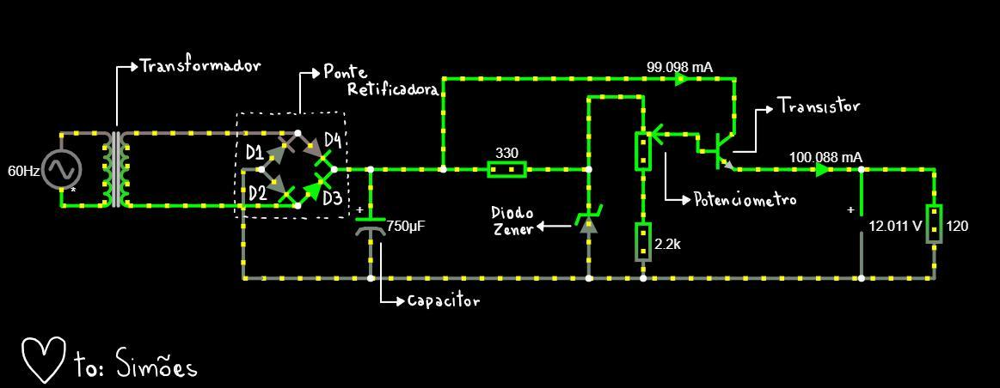
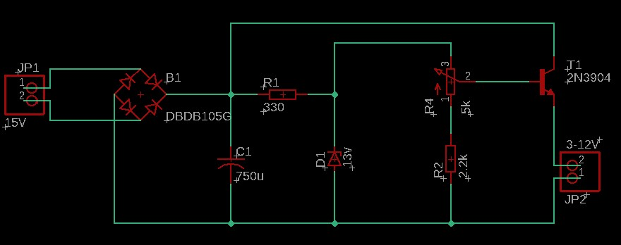
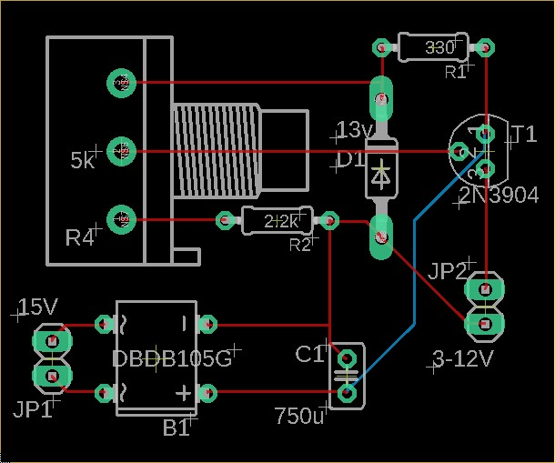
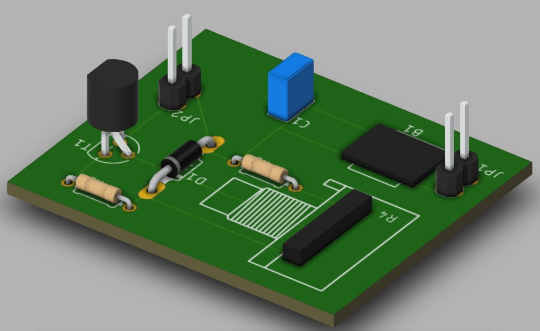

# Projeto Fonte Retificadora

## Projeto da Disciplina SSC0180 - Eletrônica para Computação

## Alunos:
Gabriel Alves Kuabara ([KU](https://github.com/GKuabara)) - N° USP 11275043

Guilherme Machado Rios ([Bio](https://github.com/Guibi0)) - N° USP 11222839

Guilherme Lourenço de Toledo ([Vinho](https://github.com/guitld)) - N° USP 11795811

Victor Henrique de Sa Silva ([Spider](https://github.com/VictorHenrique)) - N° USP 11795759

## Instruções:
Projeto de fonte retificadora de tensão contínua entre 3V a 12V com capacidade de 100mA.
A partir de uma tomada de 127V de corrente alternada e frequência de 60Hz, a fonte deve ser capaz de deixar a corrente contínua com tensão ajustável entre 3V a 12V.

## Imagem do Circuito Falstad:

## [Link do Circuito Falstad](http://tinyurl.com/yd8kujmg)

## Imagem do esquemático da PCB no software EAGLE
*O transformador foi separado da placa principal devido ao seu tamanho

## Imagem da PCB no software EAGLE
*O transformador foi separado da placa principal devido ao seu tamanho

## Simulações 3D no softaware Fusion 360
*O transformador foi separado da placa principal devido ao seu tamanho
### Topo

### Frente

### Costas 1

### Costas 2

## Vídeos Explicativos do Circuito:

  [Escolha de cada componente](https://www.youtube.com/watch?v=MA9W5LkvAV4&feature=youtu.be)
  
  [Cálculos relacionados ao circuito](https://www.youtube.com/watch?v=VsMtwc1UD2E)

## Componentes do Circuito:
* **Transformador** - Sendo o primeiro componente da fonte, esse serve para reduzir a tensão de entrada da tomada para o valor de 15V, tensão próxima de funcionamento da fonte. Porém, a corrente continua alternada com semiciclo negativo e positivo, e a tensão oscilando bastante ainda.

* **Diodos** - Responsáveis pela retificação do circuito, isso é, transformar a corrente alternada em corrente contínua atráves da inversão de um dos semiciclos. Na imagem acima, os diodos pares estão polarizados durante o semiciclo positivo e os diodos ímpares estão cortados. Já durante o semiciclo negativo, os diodos assumem papel oposto. Além disso, apesar de termos a corrente contínua, ainda existem variações na tensão quando há a troca de semiciclos denominadas "ripples"(variação residual periodica derivada de uma corrente alternada).

* **Capacitor** - Faz o papel da filtragem de modo a reduzir o "ripple" para maior estabilidade da corrente. Assim, o capacitor carrega durante o pico de tensão, e quando a tensão diminui para o semiciclo inverso, a tensão interna do capacitor supera a tensão do circuito, fazendo com que o capacitor alimente o circuito, logo diminuindo o "ripple".

* **Resistores** - Fazem o papel de proteção dos componentes do circuitos, evitando que a corrente ultrapasse os valores de funcionamento dos componentes evitando que explodam na nossa cara, amém.

* **Potenciometro** - Resistor de resistência variável que permite a variação da tensão entre 3V e 12V. 

* **Diodo Zener** - Regula a tensão máxima do circuito. O zener conduz corrente somente quando acima da corrente de ruptura e assim diminui a corrente para a tensão nominal do diodo. Dessa forma, mantem a tensão entre os seus terminais quando acima da mínima, nesse caso 12V. 

* **Transistor NPN** - Capaz de controlar a corrente elétrica de maneira ajustável.

## Componentes, especificações e valores:
| **Quantidade** | **Componentes**   | **Especificações** | **Valor**|
|----------------|-------------------|--------------------|----------|
|         1x     | [Transformador](https://produto.mercadolivre.com.br/MLB-1299159736-transformador-1515v-1a-trafo-bivolt-_JM?matt_tool=82322591&matt_word&gclid=Cj0KCQjw3Nv3BRC8ARIsAPh8hgKeMy0nJofiC6KaxPgJOotdfYedegX4Cvw1K8ZATrrtRfrb-_nViN8aAoY1EALw_wcB&quantity=1) | 15V | R$ 29.90|
|         4x     | [Diodo](https://www.arduoeletro.com/diodo-1n-4007?utm_source=Site&utm_medium=GoogleMerchant&utm_campaign=GoogleMerchant&gclid=Cj0KCQjw3Nv3BRC8ARIsAPh8hgJ0wxy2Hp_5nHJ2fnSKeIm5tyTmb2PZhb8mVqMMBYZ7-NIENwZE6ToaAscCEALw_wcB) | Normal |  R$ 0.40|
|         1x     | [Capacitor Eletrolítico](https://www.eletrogate.com/capacitor-eletrolitico-1000uf-x-16v?utm_source=Site&utm_medium=GoogleMerchant&utm_campaign=GoogleMerchant&gclid=Cj0KCQjwoub3BRC6ARIsABGhnyZ_RIU0_78Q12_vGcE23LCamEqiIbno5rkSUVdKnD0BTOSjUcxPa7oaAkqBEALw_wcB) | 750uF |  R$ 0.45|
|         1x     | [Resistor](https://produto.mercadolivre.com.br/MLB-1342907792-resistor-330-ohms-100-unidades-_JM?matt_tool=79246729&matt_word&gclid=Cj0KCQjw3Nv3BRC8ARIsAPh8hgLQmDXTySOG5SPVeSkZzxwxIkQ18u9yLq5I2XRCE6nhx1F0_QvOYmUaAspBEALw_wcB&quantity=1) | 330ohms |  R$ 0.13|
|         1x     | [Resistor](https://produto.mercadolivre.com.br/MLB-937733782-kit-10-x-resistor-22k-ohm-14w-1-projeto-arduino-raspberry-_JM?matt_tool=79246729&matt_word&gclid=Cj0KCQjw3Nv3BRC8ARIsAPh8hgKAe7Wy7yk2gXiOZ5dqMArm00GkyamfaNH7T7loakiJhOX3ozAropwaAhECEALw_wcB&quantity=1) | 2.2k |  R$ 0.86|
|         1x     | [Diodo](https://www.americanas.com.br/produto/1397103736?opn=YSMESP&sellerid=4145166000157&epar=bp_pl_00_go_am_todas_geral_gmv&WT.srch=1&acc=e789ea56094489dffd798f86ff51c7a9&i=5dd8ae5049f937f6254fab94&o=5df60079f8e95eac3dac6177&gclid=Cj0KCQjw3Nv3BRC8ARIsAPh8hgIA358SW4MTZbxC3F3oDX6124FH0DvY33t5ULAEiQPJIl66QkP-IVgaApfTEALw_wcB) | Zener 13V |  R$ 0.60|
|         1x     | [Potenciômetro](https://www.baudaeletronica.com.br/potenciometro-linear-de-5k-5000.html) | 5k |  R$ 1.15|
|         1x     | [Transistor](https://www.google.com/aclk?sa=l&ai=DChcSEwjDyLSEq6PqAhUHCJEKHRbGAwYYABAEGgJjZQ&sig=AOD64_1MjzoeLBrcoe0HWlJstQacJ3uwSg&ctype=5&q=&ved=0ahUKEwi_9K-Eq6PqAhX3ErkGHQihCi0Q2CkI0gI&adurl=) | NPN |  R$ 1.75|
| **Total** ||| R$ 38.18 |

## Agradecimentos:
Obrigado Simões pela extrema coerência mostrada em suas atitudes como docente no contexto atual ♡♡
